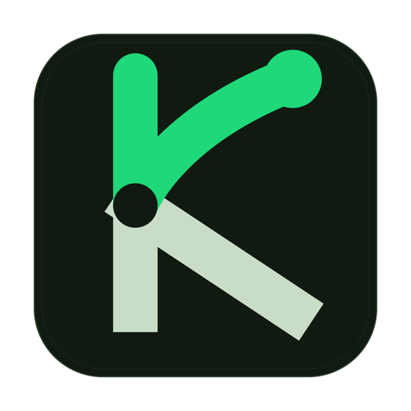

<div align="center">
  
  <h1>Kinetik</h1>
  <p><b>A beautiful, native macOS habit tracker built with SwiftUI.</b></p>

  <p>
    <a href="https://github.com/bzasdhfj/kinetik/stargazers"></a>
    <a href="https://github.com/bzasdhfj/kinetik/blob/main/LICENSE"></a>
    <a href="https://swift.org/"></a>
    <a href="https://developer.apple.com/macos/"></a>
  </p>
</div>

<br>

**Kinetik** is a meticulously designed macOS desktop application that helps you track your daily habits and tasks. Designed strictly around Apple's Human Interface Guidelines (HIG), it leverages cutting-edge SwiftUI features to deliver a premium, glassmorphic user experience right on your Mac.

## ✨ Features

- **Native macOS Design**: Built 100% with SwiftUI, featuring translucent `GlassBackground`, smooth spring animations, and native haptic feedback.
- **Desktop Widgets**: Includes beautifully crafted Medium and Large desktop widgets. Your check-in heatmap is always just a glance away on your desktop.
- **Dynamic Task System**: Easily manage "Required" and "Bonus" daily tasks. Settings sync instantly across the app and widgets.
- **Retroactive Check-ins**: Forgot to log yesterday? You can only retroactively check in "Bonus" tasks, keeping your core streaks honest!
- **Data Visualization**: View your check-in history through an interactive GitHub-style heatmap and an elegant, animated line chart.
- **Lightweight & Fast**: Zero external dependencies. All data is persisted locally and securely using native macOS file system APIs.

## 📸 Screenshots

*(Replace these with your actual screenshots when publishing)*

| Main Dashboard | Desktop Widget |
| :---: | :---: |
|  |  |

### Prerequisites
- **macOS 14.0 (Sonoma)** or later.
- **Xcode 15.0** or later (if building from source).

### Building from source
1. Clone the repository:
   ```bash
   git clone https://github.com/yourusername/kinetik.git
   ```
2. Open `CheckInApp.xcodeproj` in Xcode.
3. Select the `CheckInApp` scheme and hit `Cmd + R` to build and run!

## 🛠 Tech Stack

- **Framework**: SwiftUI
- **Architecture**: MVVM
- **Persistence**: Local JSON Storage (Shared Container for App & Widget)
- **Extensions**: WidgetKit, AppIntents (for interactive widgets)

## 🤝 Contributing

Contributions, issues, and feature requests are welcome! Feel free to check the [issues page](https://github.com/yourusername/kinetik/issues).

1. Fork the Project
2. Create your Feature Branch (`git checkout -b feature/AmazingFeature`)
3. Commit your Changes (`git commit -m 'Add some AmazingFeature'`)
4. Push to the Branch (`git push origin feature/AmazingFeature`)
5. Open a Pull Request

## 📄 License

Distributed under the MIT License. See `LICENSE` for more information.

---
<div align="center">
  <sub>Built with ❤️ by an independent developer.</sub>
</div>
